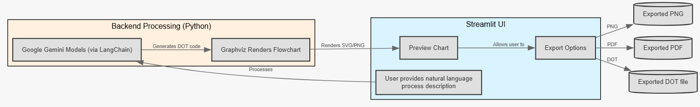

# 🧠 AI Flowchart Generator

This tool converts natural language process descriptions into flowcharts using Google Gemini models (via LangChain) and renders them with Graphviz. Users can preview the chart and export it as PNG, PDF, or DOT files. Built with a modular architecture and a Streamlit UI, this project is ready for deployment and extensibility.

---

## 🚀 Features

- 🔄 Prompt-to-Flowchart generation with LangChain + Gemini
- 🖼️ Graphviz rendering engine
- 📥 Download as PNG, PDF, or DOT
- 📦 Clean, modular, and maintainable structure

---

## Demo Video

